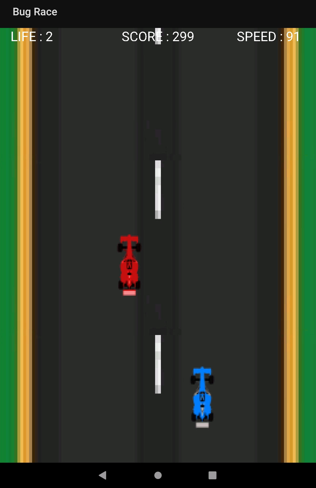

## Bug Race

### Introduction
This is a simple Android race game.

The player is the blue car and ennemies are all other objects on the map: red cars, oil splashes and flying bugs. The movement is done with pressing left or right screen parts. The goal is to avoid everything the longer possible, the speed is also increasing slowly to make the game more difficult.

### Building

The project is a GitLab repository mirror, so it has a GitLab CI script.
You can build the application manually with :
```bash
./gradlew assembleDebug
```
For building you will need [Android SDK](https://developer.android.com/about/versions/10/setup-sdk)

### Screenshots

Here is how the app looks : 


